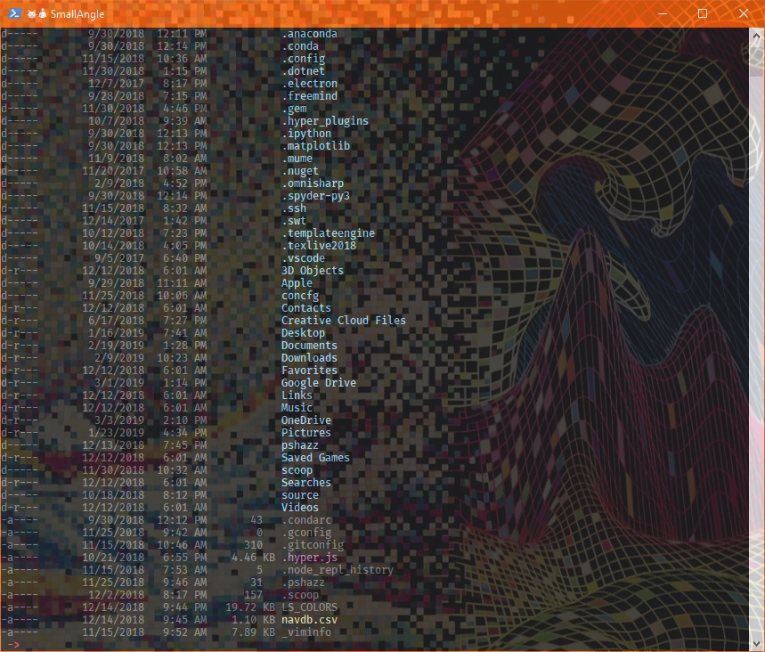
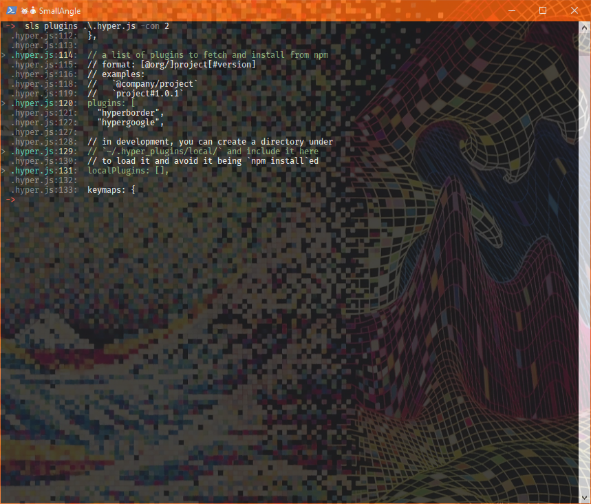
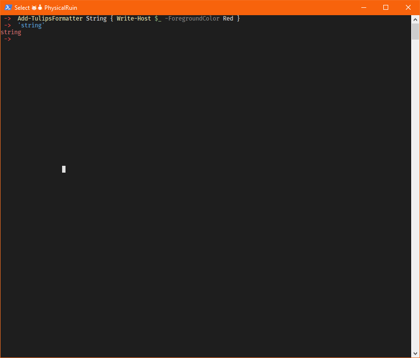

# tuliPS

tuliPS wraps Out-Default to provide a way to customize and colorize PowerShell outputs easily.
tuliPS injects custom formatting functions into Out-Default and allows for powerful customization.

Features:

- Colorize FileInfo and DirectoryInfo objects
- Colorize MatchInfo objects
- Display the targets of symbolic links and directory junction points
- A human-readable and straight forward config file devoid of regex
- Easy saving and loading of settings
- Supports custom user extensions that can format _any_<sup>*</sup> object

## Installation

Since this is a rough idea that could use polishing, it is not published anywhere.
I will provide build zips on the [releases][rel] page.

In general, clone this repository and run `nova.bat`.
Select `D` to run the Default task, which will build the module and install it into the local modules directory.

### Manual Build

Run `build.bat` and install the module in the `Output` directory to a location of your choosing.

### Other Tasks

Alternatively, call Nova directly

``` powershell
& nova.ps1 -Task Default   # or whichever task you'd like
```

## Usage

After the module is installed somewhere in the module path, just import the module.

``` powershell
Import-Module tuliPS

# Change the settings
Set-Tulips -AddExtensionSet Media -ForegroundColor Yellow -BackgroundColor Black -Extensions '.jpg', '.png'

# Save the settings
Export-Tulips ~/tulips.xml

# Load the settings
Import-Tulips ~/tulips.xml
```

## Background

Microsoft Consoles did not support Virtual Terminal (VT) ANSI escape sequences for color output support.
Combining ANSI sequences with the PowerShell type formatting (format.ps1xml) allows for very powerful control over formatting.
Check out [DirColors][dircolors] by Dustin Howett for a fantastic example.

However, I hate ANSI escape sequences and virtual terminal support for it.
It's ancient.
It's clunky.
It's hard to read.
And it needs an update.
Why are we still using old hardware codes for hardware that doesn't exist to tell modern software what to do?

This is my attempt at an easily configurable color formatter for Out-Default that doesn't use regex or escape codes.

## Custom Formatters

Format any<sup>*</sup> object of your choosing. You can set one formatter per object.

Keep the following two tips in mind:

1. You must pass the object as the current object in the pipe with `$_` or `$PSItem`, else the object will get stuck in limbo
2. You must somehow write the object to the host, or you won't see it; `Write-Host` and the `Console` methods are you friends

Remember, tuliPS uses `Out-Default`, so how you see an object presented in the console is _not_ how the object will be passed to stdout or to the pipe.

Tips:

- Keep your types to singular types, that is, don't try to process string[]!
- Use `Set-TulipsFormatter` to overwrite type formatters
- The format operator, `-f`, is your friend

``` powershell
# Easy example.
Add-TulipsFormatter -Type System.String -Scriptblock { Write-Host $_ -ForegroundColor Red }

# Simple types can be infered.
Add-TulipsFormatter Int { '{0:P}' -f $_ | Write-Host }

# You can use your own complex functions.
Add-TulipsFormatter System.Diagnostics.Process { Format-MyProcess $_ }   # Just be sure Format-MyProcess isn't private 
```


## Screenshots







## Credit

Inspiration by David Lindblad ([PSColor][pscolor]) and David Howett ([DirColors][dircolors]).
Credit also to [Kevin Marquette][kmart] for pieces of his (old) versioning system and build script ideas.


---
<sup>* I haven't tested custom PSObjects that are given a defined type name or PSClasses _yet_</sup>  
Last Updated: 2019-03-12T10:05:32.1875582-04:00

<!-- refs -->
[rel]: https://github.com/endowdly/tuliPS/releases
[pscolor]: https://github.com/Davlind/PSColor
[dircolors]: https://github.com/DHowett/DirColors
[kmart]: https://powershellexplained.com/
